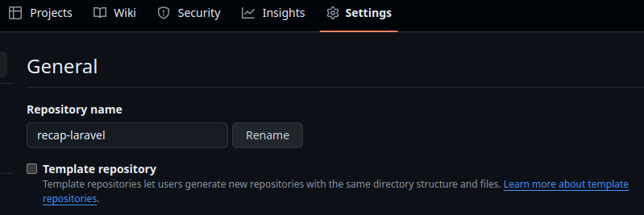
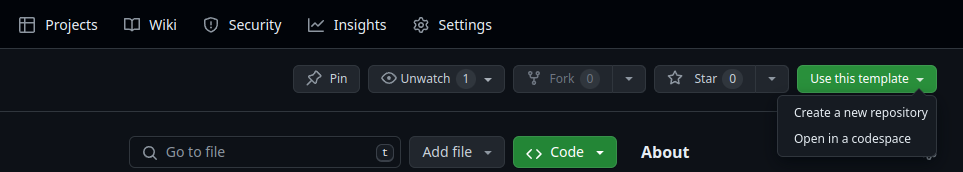
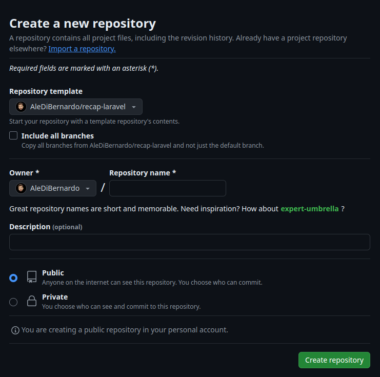
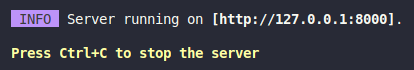

### RECAP LARAVEL
---
# PRIMI PASSAGGI


## 1. Creare una Repository su GitHub da Template

- ### creare la repo per il template 
- ### andare in setting e spuntare `Template repository`

    
- ### cliccare sul bottone `Use this template`
    
- ### successivamente su `Create a new repository`
    
- ### mettere il nome della repo e successivamente `Create repository`
- ### clonare la propria repo in locale

## 2. Installare le Dipendenze
```sh
composer install
```

```sh
npm install
```

## 3. Copia di `.env`
- Copiare `.env.example`
- Incollare e rinominare come `.env`

## 4. Generazione della Chiave
```sh
php artisan key:generate
```

## 5. Avviare i Server
### Su due terminali diversi
```sh
php artisan serve
```
```sh
npm run dev
```

## 6. Aprire il Link di Artisan Serve


## 7. Avviare MAMP/LAMP

## 8. Creare il Database in MAMP/LAMP

## 9. Importare il File del Database
---

# PRENDERE DATI DA UN DATABASE

## Collegare il Progetto al Database
In `.env`, settare le seguenti informazioni:

```env
DB_PORT=mettereLaPorta
DB_DATABASE=nomeDatabase
DB_USERNAME=root
DB_PASSWORD=root OR vuota OR passwordDatabase
```

## Interagire con l'ORM
Utilizzare Eloquent, l'ORM di Laravel.

---

## MIGRATION
### Creazione della Migration

Per creare una nuova migration, usa il seguente comando:
```sh
php artisan make:migration create_nome_tabella_table
```
Esempio: `create_houses_table`

La migration si troverà in `database/migrations`.

### Funzioni della Migration

#### Funzione `up()`

- Viene chiamata all'avvio e si occupa di creare la tabella tramite `Schema::create()` con la primary key.
- All'interno della tabella, oltre all'id, ci saranno i campi `CREATED_AT` e `UPDATED_AT` che tengono conto della data di creazione e aggiornamento della tabella.

#### Funzione `down()`

- Viene chiamata quando si vuole tornare indietro, solitamente per eliminare la tabella.

### Avviare le Migration

Per avviare le migration, utilizza il comando:
```sh
php artisan migrate
```
Questo comando esegue la funzione `up()` di tutte le migration non ancora eseguite.

**IMPORTANTE:** Grazie a questo comando, il database sarà sempre aggiornato.

### Batch

Il batch fornisce la cronologia delle modifiche appartenenti allo stesso batch. È possibile vedere i batch nella tabella `migrations` del database.

### Rollback

Per eseguire il rollback dell'ultimo batch, utilizza il comando:
```sh
php artisan migrate:rollback
```
Questo comando rimuove l'ultimo batch eseguendo la funzione `down()` delle migration appartenenti allo stesso batch, in poche parole esegue il `DROP TABLE`.

### Migration di Modifica

Per creare una migration di modifica, utilizza il comando:
```sh
php artisan make:migration update_nome_tabella_table --table=nome_tabella
```

Si utilizza quado per esempio si lavora in team e ci sono delle modifiche per colpa di un errore e invece di dire al team di fare rollback (sarebbe complicato) facciamo una migration di modifica semplicemente.

Questo comando creerà una nuova migration con `Schema::table()` al posto di `Schema::create()`.

### Cancellare le Migration

Per cancellare tutte le migration dal database e tutti i dati, utilizza il comando:
```sh
php artisan migrate:reset
```
Le migration nel progetto restano.

**<span style="color: red;">ATTENZIONE:</span>** **è un comando pericoloso soprattutto in produzione.**

---

# SEEDER

## Creare il Seeder
```bash
php artisan make:seeder NomeTableSeeder
```
Lo troveremo in `database/seeders`.

### Funzione `run()`
**Verrà eseguita all'inizio.**

```php

class HousesTableSeeder extends Seeder{
	
	public function run(): void
	{
		//code here
	}
}
```

## Creazione di un Record
```php
class HousesTableSeeder extends Seeder {
    public function run(): void {
        $newHouse = new House(); // Istanza del model
        $newHouse->address = "dato";
        $newHouse->city = "Milano";
        
        dd($newHouse); // Stamperà un model di house
    }
}
```

## Eseguire un Seeder
```bash
php artisan db:seed --class=HousesTableSeeder
```
> **Nota:** Per ora non ci sono i dati nel database.

## Salvare i Dati
```php
class HousesTableSeeder extends Seeder {
    public function run(): void {
        $newHouse = new House(); // Istanza del model
        $newHouse->address = "dato";
        $newHouse->city = "Milano";
        
        // dd($newHouse); // Stamperà un model di house
        
        $newHouse->save(); // Per salvare i dati e aggiungerli al database
    }
}
```

## Come Usare la Classe Faker per Generare Dati Fittizi (metodo 1)

[Documentazione Faker](https://fakerphp.org/)
> **Nota:** Faker è implementato in Laravel


### Come Usarlo
```php
use Faker\Generator as Faker;

class HousesTableSeeder extends Seeder {
    public function run(Faker $faker): void {
        $newHouse = new House(); // Istanza del model
        $newHouse->address = $faker->streetAddress();
        $newHouse->city = $faker->city();
        
        // dd($newHouse); // Stamperà un model di house
        
        $newHouse->save(); // Per salvare i dati e aggiungerli al database
    }
}
```

> **Nota:** Se si volessero più dati basta fare un ciclo `for`.

```php
use Faker\Generator as Faker;

class HousesTableSeeder extends Seeder {
    public function run(Faker $faker): void {
        for ($i = 0; $i < 10; $i++) { // Genera 10 record
            $newHouse = new House(); // Istanza del model
            $newHouse->address = $faker->streetAddress();
            $newHouse->city = $faker->city();
            
            $newHouse->save(); // Per salvare i dati e aggiungerli al database
        }
    }
}
```

## Usare Faker con Locale in Italiano

### Nella Funzione `run()`
```php
use Faker\Factory as Faker;

class HousesTableSeeder extends Seeder {
    public function run(): void {
        $faker = Faker::create('it_IT');

        $newHouse = new House(); // Istanza del model
        $newHouse->address = $faker->streetAddress();
        $newHouse->city = $faker->city();

        $newHouse->save(); // Per salvare i dati e aggiungerli al database
    }
}
```

## Prendere Dati da File di Configurazione (metodo 2)

### Creare il File `seeder-data.php` con dati creati da ChatGPT
Creiamo il file `config/seeder-data.php` con il nostro array di array associativi:

```php
<?php
return [
    // array associativi
    [
        'address' => 'Via Roma 1',
        'city' => 'Milano'
    ],
    [
        'address' => 'Via Milano 2',
        'city' => 'Roma'
    ],
    // aggiungere altri dati se necessario
];
```

### Utilizzare i Dati nella Funzione `run()`
```php
class HousesTableSeeder extends Seeder {
    public function run(): void {
        $housesData = config('seeder-data');

        foreach ($housesData as $houseData) {
            $newHouse = new House(); // Istanza del model
            $newHouse->address = $houseData['address'];
            $newHouse->city = $houseData['city'];
            
            $newHouse->save(); // Per salvare i dati e aggiungerli al database
        }
    }
}
```

## Come Non Ripetere Sempre le Chiavi (non funziona)

Nel caso in cui i dati nell'array hanno lo stesso nome delle chiavi che corrispondono ai nomi delle colonne e abbiamo inserito l'attributo `fillable` nella classe del model sul quale lavoriamo, possiamo fare così:

### House.php
```php
use Illuminate\Database\Eloquent\Factories\HasFactory;
use Illuminate\Database\Eloquent\Model;

class House extends Model {
    use HasFactory;
    
    protected $fillable = [
        'address', 'city', 'state', 'square_meters', 'rooms_number', 
        'description', 'price', 'is_available', 'energy_rating'
    ];
}
```

### Utilizzare `fill` nella Funzione `run()`
```php
class HousesTableSeeder extends Seeder {
    public function run(): void {
        $housesData = config('seeder-data');

        foreach ($housesData as $houseData) {
            $newHouse = new House(); // Istanza del model
            $newHouse->fill($houseData);
            
            $newHouse->save(); // Per salvare i dati e aggiungerli al database
        }
    }
}
```

## Prendere Dati Tramite API (metodo 3)

### Esempio di Utilizzo di API nella Funzione `run()`
```php
use Illuminate\Support\Facades\Http;

class HousesTableSeeder extends Seeder {
    public function run(): void {
        $response = Http::get('https://api.example.com/houses');
        $housesData = $response->json();

        foreach ($housesData as $houseData) {
            $newHouse = new House(); // Istanza del model
            $newHouse->fill($houseData);

            $newHouse->save(); // Per salvare i dati e aggiungerli al database
        }
    }
}
```

## Ricordati di:

### 1. Creare la Tabella `Players`

#### Creare la Migration
```bash
php artisan make:migration create_players_table
```

#### Definire la Migration
```php
// database/migrations/xxxx_xx_xx_xxxxxx_create_players_table.php

use Illuminate\Database\Migrations\Migration;
use Illuminate\Database\Schema\Blueprint;
use Illuminate\Support\Facades\Schema;

class CreatePlayersTable extends Migration {
    public function up(): void {
        Schema::create('players', function (Blueprint $table) {
            $table->id();
            $table->string('name');
            $table->integer('age');
            $table->string('position');
            $table->timestamps();
        });
    }

    public function down(): void {
        Schema::dropIfExists('players');
    }
}
```

### 2. Far Partire la Migration
```bash
php artisan migrate
```

### 3. Creare il Model `Player`
```bash
php artisan make:model Player
```

### 4. Creare il Seeder `PlayersTableSeeder`
```bash
php artisan make:seeder PlayersTableSeeder
```

## Effettuare la Chiamata API

### Configurare il Token nel File `.env`
```env
FUTDB_API_TOKEN=your_token_here
```

### Modificare il Seeder
```php
// database/seeders/PlayersTableSeeder.php

use Illuminate\Database\Seeder;
use Illuminate\Support\Facades\Http;
use App\Models\Player;

class PlayersTableSeeder extends Seeder {
    public function run(): void {
        $response = Http::withHeaders([
            'X-AUTH-TOKEN' => env('FUTDB_API_TOKEN')
        ])->get('https://futdb.app/api/players');
        
        $data = $response->json(); // Prendere i dati come array associativo

        foreach ($data['items'] as $playerData) {
            $newPlayer = new Player();
            $newPlayer->name = $playerData['name'];
            $newPlayer->age = $playerData['age'];
            $newPlayer->position = $playerData['position'];

            $newPlayer->save(); // Salvare i dati e aggiungerli al database
        }
    }
}
```

### Eseguire il Seeder
```bash
php artisan db:seed --class=PlayersTableSeeder
```

---

## MODEL
### Creare il Model
```sh
php artisan make:model NomeModel
```
Il nome deve essere come quello della tabella del database, ma al singolare e con l'iniziale maiuscola. Il model sarà già collegato alla tabella corrispondente e avrà tutti i dati.

---

## VIEW
### Creare la View
Creare `nomeTabella.blade.php` in `views` e usare `@extends` e `@section`.

---

## CONTROLLER
### Creare un Controller
In `app/Http/Controllers`, creare i controller:
```sh
php artisan make:controller NomeModelController
```

### Collegare il Model al Controller
```php
use App\Models\NomeModel;

class NomeModelController extends Controller {
    // prossimo passaggio
}
```

### Funzione `index()`
Questa funzione esegue ciò che era previsto nella route:
```php
public function index() {
    $data = config("nomeFile.nomeArrayAssociativo");
    return view('home', compact("data"));
}
```

### Richiamare il Controller nella Route
```php
Route::get('/', [NomeModelController::class, 'index'])->name('home');
```

### Collegare il Controller in `web.php`
```php
use App\Http\NomeModelController;
```

### Prelevare Tutti i Dati della Tabella
```php
public function index() {
    $booksList = NomeModel::all(); // array di oggetti
    dd($booksList); // per stampare
    dd($booksList[0]->title); // classico array
    return view('books', compact('booksList'));
}
```

### Usare `where`:
```php
Book::where('best_seller',1)->get();
Book::where('best_seller', '!=', 1)->get(); //array
Book::where('best_seller', '!=', 1)->orderByDesc('title')->get();
Book::where('best_seller', '!=', 1)->orderByDesc('title')->limit(10)->get();
Book::where('best_seller', '!=', 1)->first(); //oggetto Model
```

### Usare `find()`:
```php
Book::find($id); //oggetto Model
```

### Salvare un dato:
```php
//istanziare oggetto ecc... 
$book->save();
```


# ALTRI PASSAGGI
---
## Ricorda
Il CSS viene scritto in `app.scss` oppure in `partials/_nomeFile.scss`, da includere in `app.scss` tramite:
```scss
@use "./partials/nomeFile" as *;
```

## Impostare Altre Rotte
In `web.php`, possiamo creare altre rotte e assegnare un nome con `->name('nome')`:
```php
Route::get('/about', function () {
    return view('about');
})->name('about');
```

## Creare un Layout
Nella cartella `views/layouts`, creare il layout base del sito chiamato `app.blade.php`. Utilizzare `@yield('content')` come segnaposto per inserire contenuti diversi in ogni pagina nel passo successivo.

## Estendere il Layout
Estendere il layout nelle altre pagine:
```php
@extends('layouts.app')

@section('content')
// QUI VA IL CONTENUTO DELLA PAGINA
@endsection
```

## Gestire il Codice
Possiamo creare una cartella `views/partials` per mettere pezzi di codice riutilizzabili come l'header e il footer, e includerli dove servono (nei file layouts) con `@include`.

## Inserire Immagini
All'interno dell'attributo `src` di un tag `img`, usare:
```php
{{ Vite::asset('percorso.estensione') }}
```

## Prendere Dati da un File (sconsigliato)
Mettere il file con i dati nell'array associativo all'interno della cartella `config`. Per prendere i dati, andare in `web.php` e nella rotta della pagina dove servono i dati, fare:
```php
$data = config("nomeFile.nomeArrayAssociativo");
```
Infine, passare i dati tramite `compact`:
```php
Route::get('/', function () {
    $data = config("nomeFile.nomeArrayAssociativo");
    return view('home', compact("data"));
})->name('home');
```


