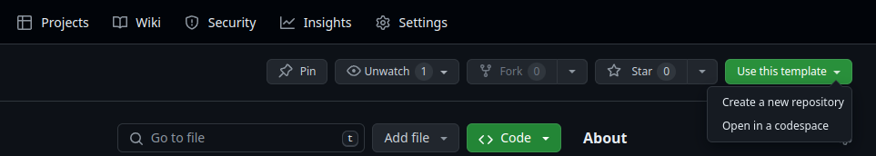

## 1. Creare una Repository su GitHub da Template

- ### creare la repo per il template 
- ### andare in setting e spuntare `Template repository`

    
- ### cliccare sul bottone `Use this template`
    
- ### successivamente su `Create a new repository`
    
- ### mettere il nome della repo e successivamente `Create repository`
- ### clonare la propria repo in locale