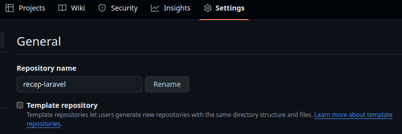
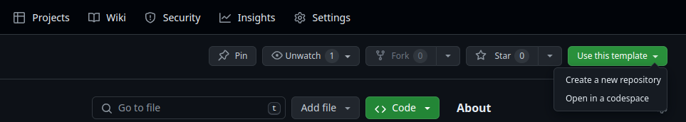
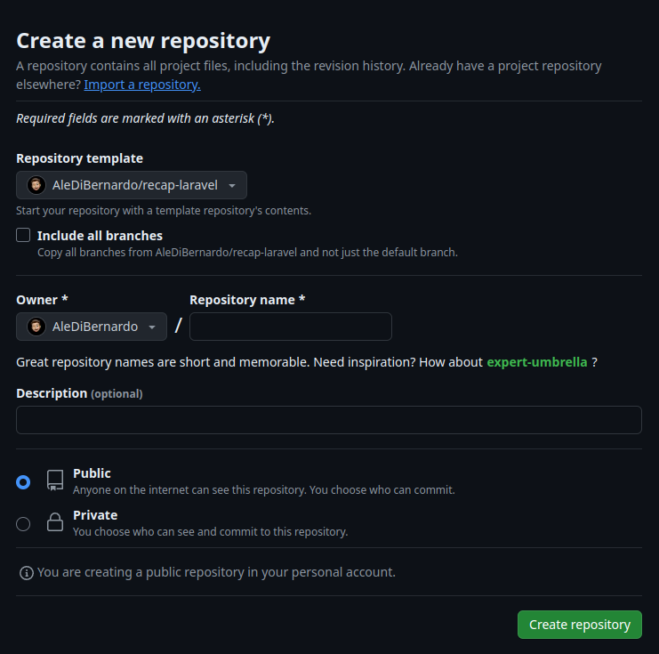
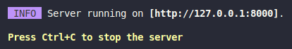

# PRIMI PASSAGGI


## 1. Creare una Repository su GitHub da Template

- ### creare la repo per il template 
- ### andare in setting e spuntare `Template repository`

    
- ### cliccare sul bottone `Use this template`
    
- ### successivamente su `Create a new repository`
    
- ### mettere il nome della repo e successivamente `Create repository`
- ### clonare la propria repo in locale

## 2. Installare le Dipendenze
```sh
composer install
```

```sh
npm install
```

## 3. Copia di `.env`
- Copiare `.env.example`
- Incollare e rinominare come `.env`

## 4. Generazione della Chiave
```sh
php artisan key:generate
```

## 5. Avviare i Server
### Su due terminali diversi
```sh
php artisan serve
```
```sh
npm run dev
```

## 6. Aprire il Link di Artisan Serve


## 7. Avviare MAMP/LAMP

## 8. Creare il Database in MAMP/LAMP

## 9. Importare il File del Database